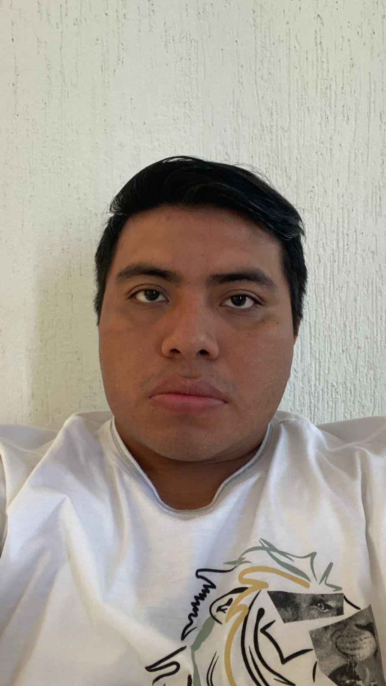
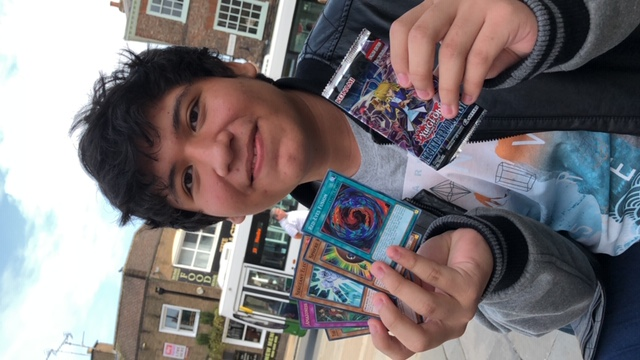
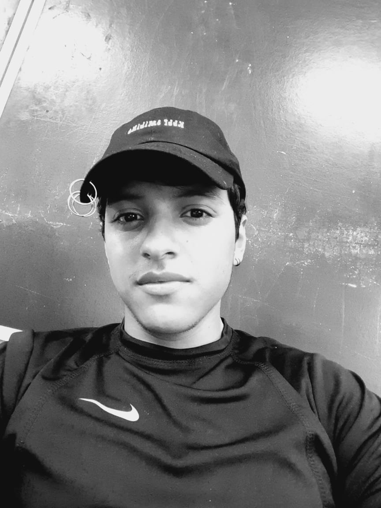
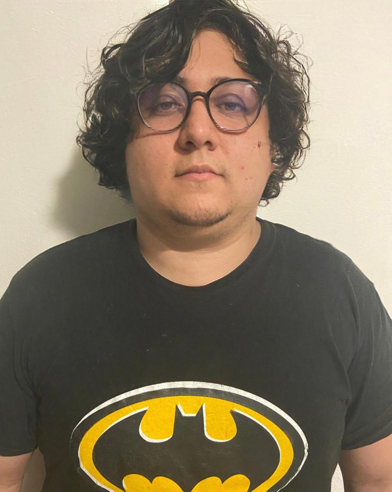

# IHC - NombreDelProyecto

<h2>Repositorio GitHub del proyecto</h2>

<h3>Integrantes:</h3>

| Nombres | José Aviles | Roger Ruz  | Benjamin Rueda  | Rafael Perea | Elias Aragon | Bryan Chale | Giovanni Quintal |
| ------------- | ------------- | ------------- | ------------- | ------------- | ------------- |------------- | ------------- |
| Foto |   |  |  |  |  | |  |
| Rol |  | | | | | | |

Encuesta: <a href="https://forms.gle/HciHoFsQt5ocM26a6">Link</a> 

Tabla de actividades: <a href="https://alumnosuady-my.sharepoint.com/:w:/g/personal/a16014862_alumnos_uady_mx/EcFsoy0Zv_pFn7cEGjRbw1IBTnuU9jFAyymjsOwrbYnVwA?e=35UA0q">Link</a>  

